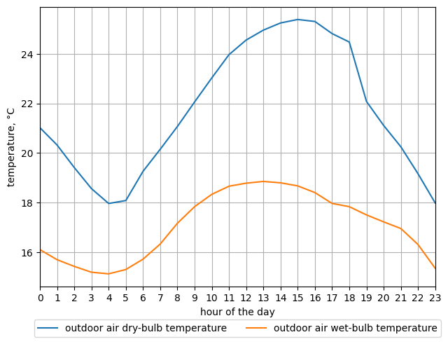
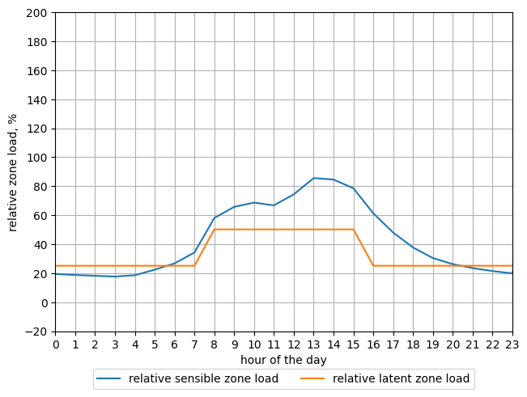
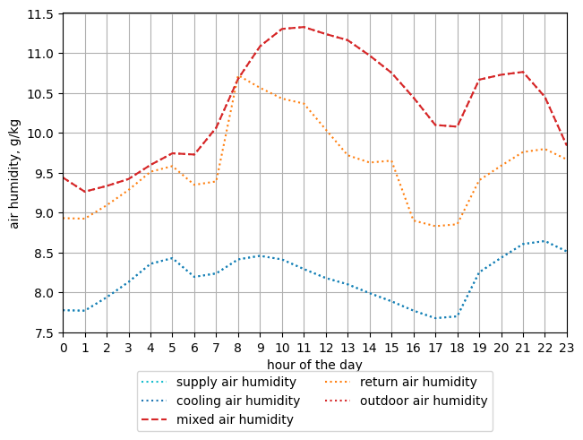
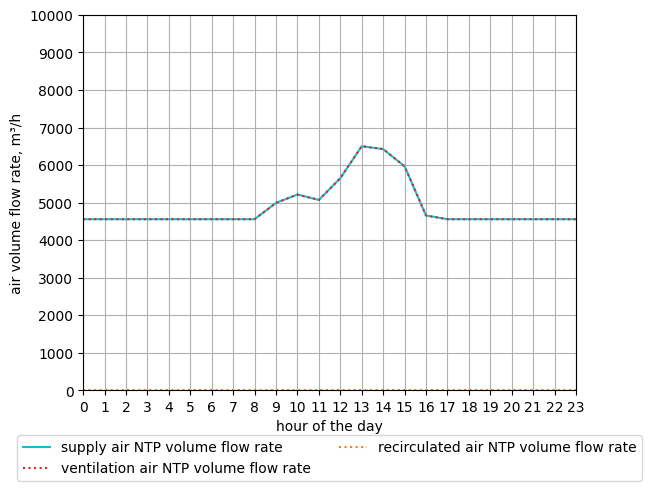
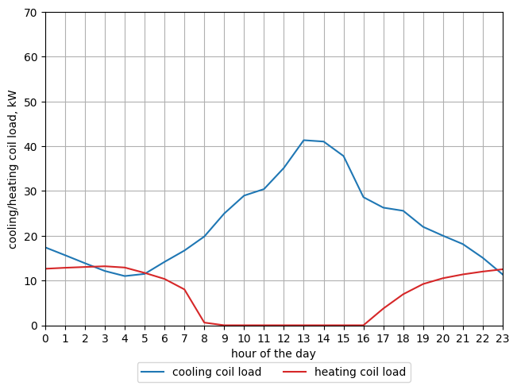

# Simulation of a Single-Zone Air-Cooling System under Part-Load Operation

> See script *part_load_operation.py* in *docs/examples/air_conditioning/example_05*

After the cooling load calculation of the single-zone building and the design of
the air-cooling system, the operation of the air-cooling system under part-load 
conditions can be simulated on an hourly basis during a selected day of the year.

For this, we will need a thermal model of the single-zone building to enable the
calculation of the hourly cooling loads in the building. We will use 
our `ExpositionHall`-model that we developed in the script *exposition_hall.py* 
(see *docs/examples/cooling_load_calc/example_01*).

Let us consider a single-zone air-cooling system with an additional heating coil
downstream of the cooling coil.

From the cooling load calculation of the building and the design calculation 
of the air-cooling system, we have the following design data at hand:
- the sensible cooling design-load of the single-zone building is 31.126 kW
- the latent cooling design-load is 17.936 kW
- the required minimal volume flow rate of ventilation air is 4400 m³/h, 
  referred to NTP (dry air of 20 °C at 101.325 kPa)
- the required volume flow rate of supply air at design conditions is 7599.946 
  m³/h referred to NTP
- the outdoor air at design conditions has a dry-bulb temperature of 26.7 °C and
  a wet-bulb temperature of 19.2 °C
- the desired zone air state has a dry-bulb temperature of 26 °C and a relative
  humidity of 50 %
- the air supplied to the zone at design conditions has a dry-bulb temperature 
  of 14 °C and an absolute humidity of 7.783 g(H2O)/kg(dry-air).

## Description of the Python Script

The design data is grouped inside an instance of the class `DesignData`
in subpackage `hvac.air_conditioning.single_zone.vav_cooling_sim`. With this 
object, we can instantiate the `VAVSingleZoneAirCoolingSystem` class, which is 
also in the subpackage `hvac.air_conditioning.single_zone.vav_cooling_sim`. This
is the main object that will do the simulation work.

To simulate the operation of the air-cooling system during a given day of the 
year, we will use hourly TMY weather data from the location where the building 
is situated. 
The function `get_simulation_data` defined in the script, is used to prepare the
simulation data.
Inside this function a `ClimateData` object (from subpackage `hvac.climate`) is 
instantiated with the TMY data we saved in a csv-file *tmy_gent_2005_2020.csv*. 
With this object, we can create an instance of our thermal model 
`ExpositionHall`. This model and the design data of the air-cooling system are 
then passed to the init-method of class `CoolingSimData` (also in subpackage 
`hvac.air_conditioning.single_zone.vav_cooling_sim`). 
On instantiation of this class the state of outdoor air, the zone air setpoint 
temperature, and the sensible and latent cooling load of the single-zone 
building are determined for each hour of the selected day, which was specified 
when calling the function `get_simulation_data`. 
The function `get_simulation_data` returns the `CoolingSimData` object.
When this object is called (see below), it will return an iterator which will 
yield a tuple with the four aforementioned elements in a for-loop, starting at 
0 h and finishing at 23 h.

Inside the `main()` function of our script, we first call our function
`get_simulation_data()`, specifying the month of the year and the day of the 
month for which we want to simulate the operation of the air-cooling system. We
also pass our thermal-model class of the single-zone building, and the design 
data of the air-cooling system to this function. The function will then return 
the `CoolingSimData` object that contains all the data needed for analyzing the
part-load operation of the air-cooling system.

In a for-loop statement we call the `CoolingSimData` object repeatedly, which 
will on each iteration, starting at 0 h and finishing at 23 h, return a tuple 
with the state of outdoor air, the zone air setpoint temperature, the sensible 
cooling load of the zone, and the latent cooling load of the zone. 
In the body of the for-loop, we call the `analyze()`-method on our 
`VAVSingleZoneAirCoolingSystem` object, passing it all the elements inside 
the current tuple. 
Inside the `analyze()`-method the steady-state operation of the single-zone 
air-cooling system is determined. The results are returned packed in an 
`Output`-object, which we append to a list `outputs`.

Once the for-loop has terminated, the results are drawn in a number of diagrams:
- the hourly profile of the dry-bulb and wet-bulb temperatures
- the hourly profile of the relative sensible and latent cooling load (i.e.,
  expressed as a fraction of their respective design load values)
- the hourly profile of supply air, cooling air, mixed air, return air, and 
  outdoor air dry-bulb temperatures
- the hourly profile of the same air humidity ratios
- the hourly profile of supply air, outdoor ventilation air, and recirculated 
  air volume flow rates (referred to NTP)
- the hourly profile of the cooling coil load and the heating coil load
- a psychrometric chart that shows the fluctuation of the space air state during
  the day

These diagrams can be shown on screen directly, or they can be saved to disk.

The `Output`-object for a given hour of the day, returned by the `analyze()`-
method contains:
- the supply air mass flow rate
- the outdoor ventilation air mass flow rate
- the recirculation air mass flow rate
- the supply air volume flow rate (NTP)
- the outdoor ventilation air volume flow rate (NTP)
- the recirculation air volume flow rate (NTP)
- the state of the outdoor air (which was actually an input)
- the state of mixed air at the entry of the cooling coil
- the state of cooled air at the exit of the cooling coil / entry of the heating
  coil
- the state of supply air at the entry of the space / exit of the heating coil
- the state of return air, which is also considered to be the state of the space
  air
- the setpoint state of the zone air (which was actually an input)
- the cooling load of the zone (which was actually an input)
- the sensible heat ratio of the zone cooling load (which was actually an input)
- the cooling coil load
- the cooling coil sensible heat ratio
- the heating coil load (if a heating coil is present in the air-cooling system)

## Description of the Part-Load Control Strategy

The `analyze()`-method starts with an initial state of the supply air to the
space or zone. The initial supply air temperature is set to the setpoint 
temperature of the cooling coil if it was specified when instantiating the 
`VAVSingleZoneAirCoolingSystem` class; otherwise the supply air temperature from
the design data is taken. The initial humidity ratio of the supply air is set 
to the humidity ratio of the air at the exit of the cooling coil if it was 
specified when instantiating the `VAVSingleZoneAirCoolingSystem` class; 
otherwise the supply air humidity ratio from the design data is taken.

### Supply Fan Control
With this initial state of the supply air, the sensible and latent cooling load 
of the space, and the zone air setpoint temperature, the required mass flow 
rate of supply air is calculated.

If the required mass flow rate should be smaller than the minimum limit needed to
properly mix the supply air with space air, the mass flow rate of supply air is 
kept to this minimum limit.
In case a heating coil is present, the required state of supply air is 
recalculated with the minimum mass flow rate of supply air so to maintain the
setpoint temperature of the space.
If no heating coil is present, but the setpoint temperature of the cooling coil
can be reset, the required state of supply air is also recalculated (however, 
under the simplifying assumption that the apparatus dew point (ADP) of the 
cooling coil, that can be derived from the design data, is a constant, 
independent of any part-load conditions).
If no heating coil is present, nor can the cooling coil setpoint 
temperature be reset, the cooling coil will be completely turned off, and 
unconditioned outdoor air is used directly to supply air to the space.

If the required mass flow rate should be greater than the maximum limit 
(i.e., the maximum flow rate the supply fan can displace), the zone air 
temperature will inevitably raise above its setpoint value, unless the cooling
coil setpoint temperature can be decreased. In that case, the required state of
supply air is recalculated.

### Mixing Control
Mixing control (aka economizer operation) controls the mixing ratio between 
outdoor air and recirculation air mass flow rates.

If the outdoor air temperature is lower than the cooling coil setpoint 
temperature, there is no need to mechanically cool the air supplied to the space.
The mixing controller controls the position of the outside air (OA) damper and 
return air (RA) damper so that the mixed air temperature matches with the supply
air setpoint temperature.

However, if the outdoor air temperature is higher than the zone air setpoint 
temperature, the outdoor air mass flow rate is restricted to a minimum value 
just sufficient to ventilate the building. The OA damper is set in its minimum 
open position, while the RA damper is set in its maximum open position.

Also, if the outdoor air temperature is between the zone air setpoint 
temperature and the cooling coil setpoint temperature, mixing would raise the 
mixed air temperature more above the outdoor air temperature and consequently 
more above the cooling coil setpoint temperature, thereby increasing the energy 
consumption to cool the air in the cooling coil. Therefore, mixing control is 
made inactive under this condition. The OA damper is set in its maximum open 
position, while the RA damper is set in its minimum open position.

### Cooling Coil Control
If the mass flow rate of supply air is at its minimum limit and no heating coil
is present, the zone air temperature will drop below its setpoint if the cooling
coil is active, unless the cooling coil controller can increase the cooling air 
setpoint temperature to get at the required state of supply air needed to 
maintain the zone air temperature setpoint.
However, only when the mixed air at the entrance of the cooling coil has a 
higher temperature than the required supply air temperature, the mixed air can 
be cooled to the required supply air temperature. Otherwise, the cooling coil 
should be turned off.
If the cooling coil controller has a fixed setpoint temperature, the cooling 
coil is always turned off when the mass flow rate of supply air is at its 
minimum limit, whatever the temperature of the mixed air might be.

If the mass flow rate of supply air is at its maximum limit, the zone air 
temperature will raise above its setpoint, unless the cooling coil controller 
can decrease the cooling air setpoint temperature to get at the required state 
of supply air needed to maintain the zone air temperature setpoint.
Again, only when the mixed air has a higher temperature than the required 
supply air temperature, the mixed air can be cooled to the required supply air 
temperature.

If the mass flow rate of supply air is between its minimum and maximum limit, 
and the mixed air temperature is higher than the cooling air setpoint 
temperature, the cooling coil controller keeps the cooled air state fixed at its
normal setpoint (both temperature and humidity ratio) and the mixed air leaving 
the mixing chamber is cooled to this setpoint.
If the mixed air temperature is already lower than or equal to the cooling coil 
setpoint temperature, there is no need to cool the air, so the cooling coil is
turned off.

### Heating Coil Control
If a heating coil is present in the air-cooling system, it can be turned on each
time the cooled air leaving the cooling coil is lower than the required
supply air temperature needed to compensate for the cooling load in the
space and maintain the zone air setpoint temperature. In the heating coil, the 
cooled and dehumidified air is heated up to the required supply air temperature.

It follows that there might be hours during the selected day that neither the 
cooling coil nor the heating coil is active. On these hours the space air is
uncontrolled or floating. For these hours in which both the cooling and the 
heating coil are off, the zone and return air temperature are set equal to the 
outdoor air temperature. In reality, it can be expected that the actual zone and
return air temperature will be fluctuating between the outside air and zone air
setpoint temperature.

## Running the Python script

The function `main()` is called by specifying the month of the year and the day
of the month. Within the for-loop of `main()` the method `analyze()` is called
for each hour of the selected day of the year. While the for-loop is running,
the results of each hour are printed on screen. For example, at hour 0 
(midnight), we get:
```text
hour: 0
outdoor air: 22.620 °C DB, 9.891 g/kg AH (57.500 % RH)
zone air setpoint temperature: 26.000 °C DB
relative sensible zone load: 14.633 %
relative latent zone load: 40.164 %
supply air mass flow rate = 5492.824 kg/h
ventilation air mass flow rate = 5492.824 kg/h
recirculation air mass flow rate = 0.000 kg/h
supply air volume flow rate (NTP) = 4559.968 m³/h
ventilation air volume flow rate (NTP) = 4559.968 m³/h
recirculation air volume flow rate (NTP) = 0.000 m³/h
outdoor air = 22.620 °C DB, 9.891 g/kg AH (57.500 % RH)
mixed air = 22.620 °C DB, 9.891 g/kg AH (57.500 % RH)
cooled air = 14.000 °C DB, 7.809 g/kg AH (78.257 % RH)
supply air = 23.073 °C DB, 7.809 g/kg AH (44.312 % RH)
return air = 26.000 °C DB, 9.657 g/kg AH (45.859 % RH)
zone air (setpoint) = 26.000 °C DB, 10.544 g/kg AH (50.000 % RH)
zone cooling load = 11.759 kW, 0.387 frac
cooling coil load = 21.532 kW, 0.623 frac
heating coil load = 14.121 kW
```
The outdoor air temperature is between the cooling coil setpoint temperature 
(14 °C) and the space air setpoint temperature (26 °C). This implies that
mixing control cannot be active. To avoid an unnecessary increase in the mixed air 
temperature at the entry of the cooling coil, the RA damper is closed, so that
the mass flow rate of recirculation air is (theoretically) zero. All the supply 
air to the zone is taken from outdoors (the mixed air state is the same as the 
outdoor air state). We see that the relative sensible space cooling load is 
small and that the supply air flow rate is kept at its minimum limit (60 % of 
the design value, which equals, according to the design data of the air-cooling 
system, 7599.946 m³/hr NTP). As a heating coil is present, the normal cooling 
coil setpoint temperature is maintained, which equals the supply air temperature
at design conditions, as can be seen in the design data of the air-cooling 
system. This results in a cooling coil load of 21.532 kW. The required supply air
temperature to maintain the space air setpoint temperature of 26 °C has been
calculated as 23.073 °C. To heat the supply air to this required supply air 
temperature the heating coil adds 14.121 kW to the supply air. When the cooling 
coil and the heating coil are both operating (the air is simultaneously cooled 
and then heated), we call this energy-wasteful operation "coil bucking". It 
is typical for CAV-systems, but it also occurs in VAV-systems operating at low 
cooling loads.

When the for-loop has finished, the results are drawn in a number of diagrams
which are saved in the *charts*-folder within the *example_05* folder.













